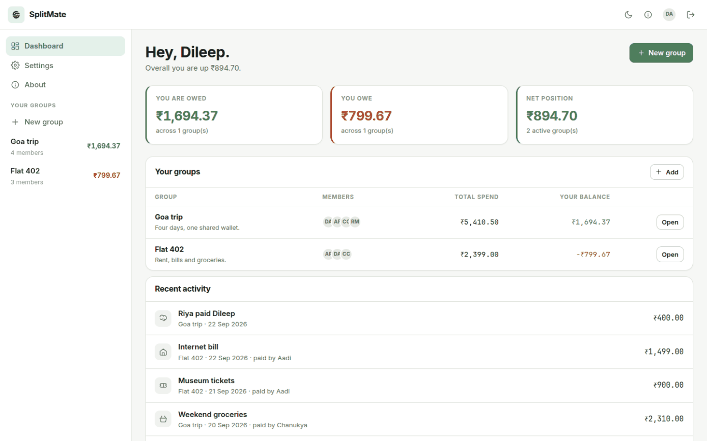
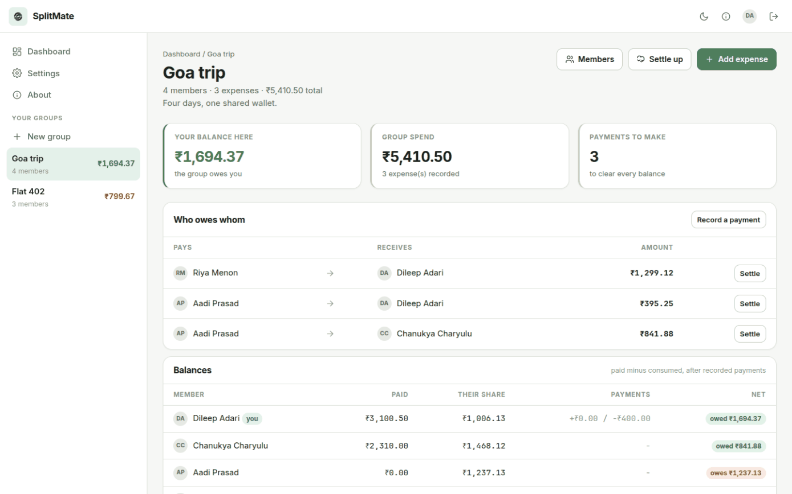
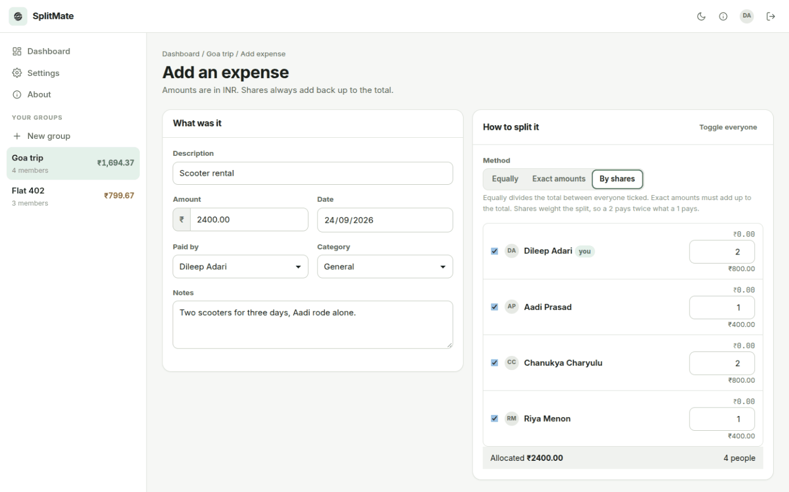
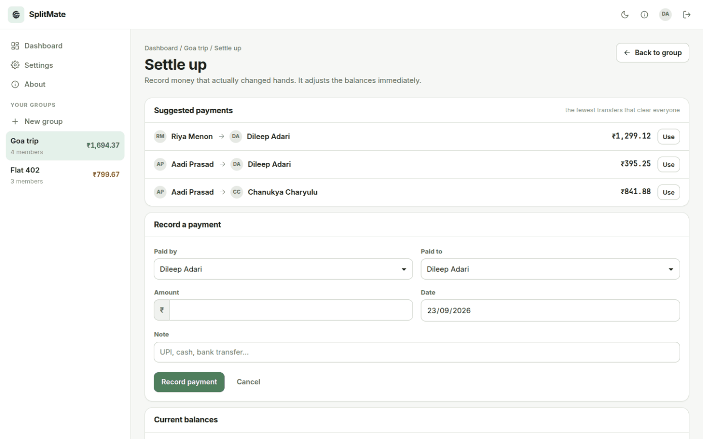
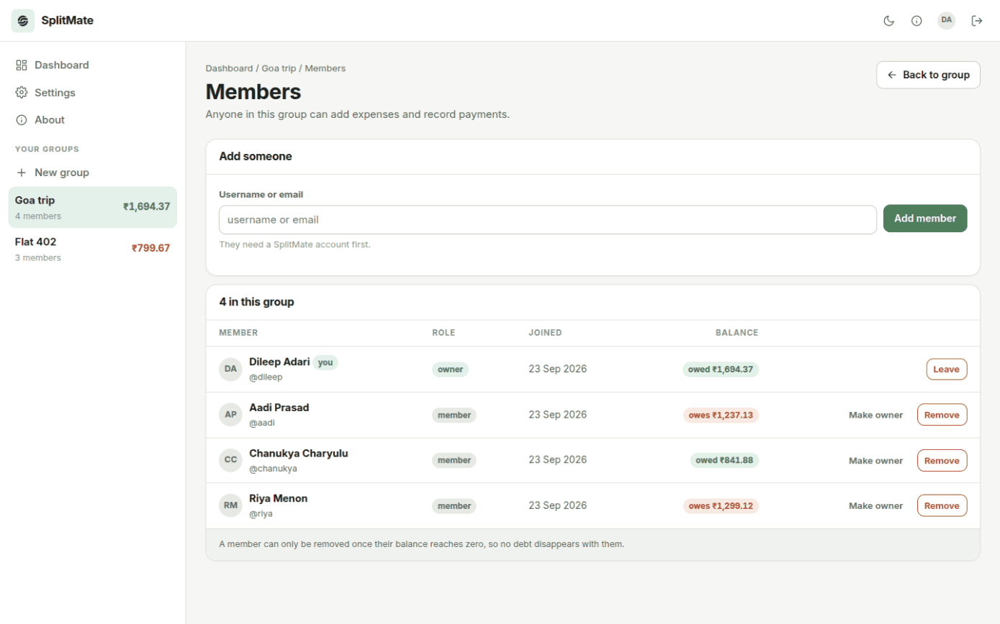
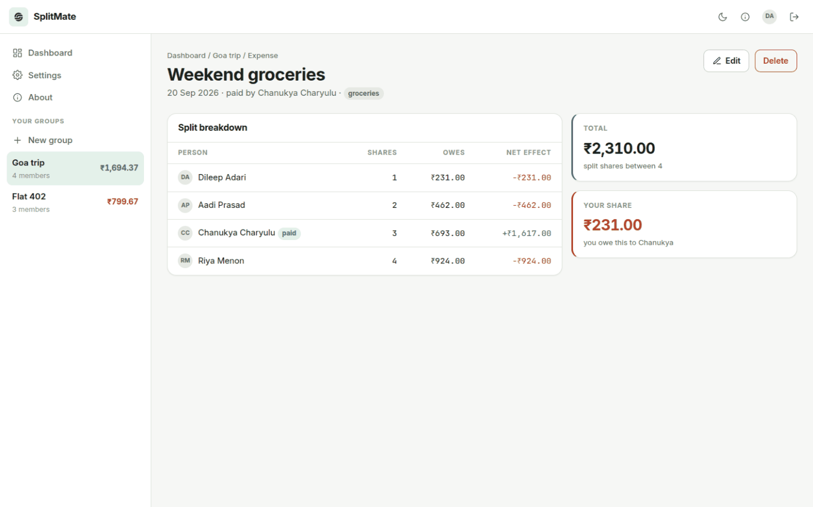
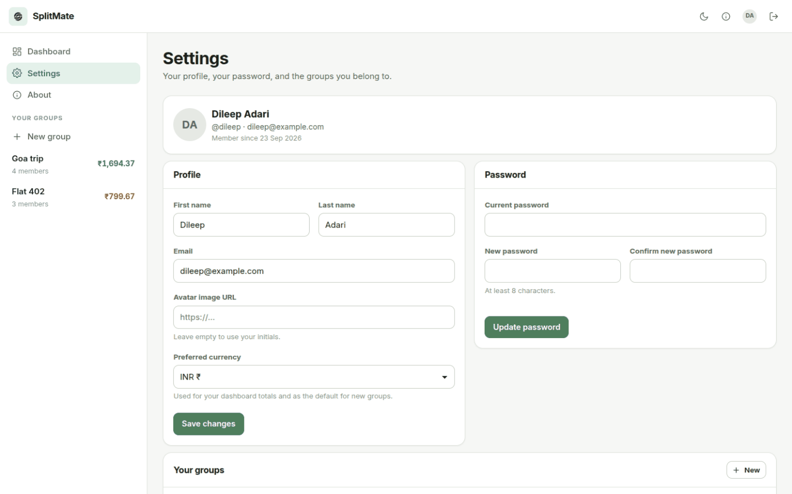
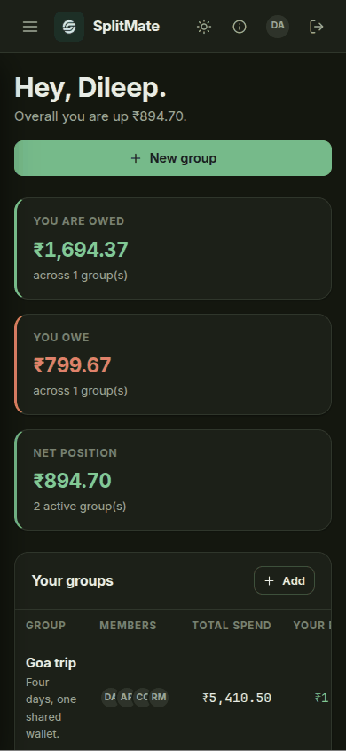
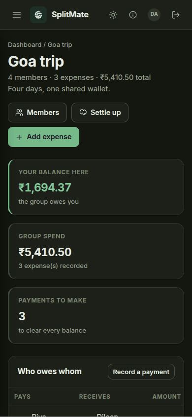
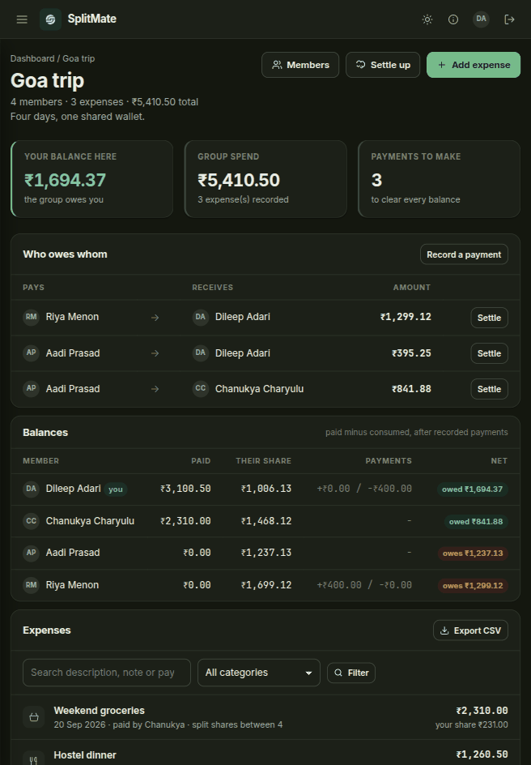

<!-- Generated from README.md by scripts/build_light_readme.py. Do not edit by hand. -->

<div align="center">

<picture>
  <source media="(prefers-color-scheme: dark)" srcset="./docs/assets/adk_dev_logo_light.png">
  
</picture>

# SplitMate

**Shared expense tracking for groups. SplitMate records who paid for what, splits each cost the way the group actually agreed, and works out the fewest payments that clear everyone.**


<br>


<br><br>

[](https://github.com/Dileepadari/SplitMate/actions/workflows/ci.yml)

**[Developer documentation](./DEVDOC.md)** &middot; [Screenshots](#screenshots) &middot; [Features](#features) &middot; [Getting started](#getting-started)

<p><b>Light mode</b> &middot; <a href="./README.md">View this page in dark mode</a></p>

</div>

---

It exists because the arithmetic after a trip is tedious and error prone. Ten expenses
across four people is forty little debts; SplitMate collapses them into at most three
payments and never loses a cent to rounding.

---

## Screenshots

Real renders against a running instance with the demo data seeded. This page shows
**dark mode**; the same gallery in light mode is at **[README-light.md](./README-light.md)**.

| | |
|---|---|
| **Dashboard** <br> Every group you are in, what you are owed and what you owe, and recent activity across all of them <br><br>  | **Inside a group** <br> Who owes whom, reduced to the fewest payments that clear everyone, above the ledger it came from <br><br>  |
| **Adding an expense** <br> Split by shares: a 2 pays twice what a 1 pays, and the amounts always add back up to the total <br><br>  | **Settling up** <br> The same suggested payments, each one click away from being recorded <br><br>  |
| **Members** <br> Roles, join dates and balances. Nobody leaves while they still owe or are owed <br><br>  | **One expense** <br> What each person's share was and what it did to their balance <br><br>  |

<p align="center"><b>Settings</b> &middot; profile, password and the currency your totals are shown in</p>
<p align="center"></p>

## Responsive layout

Above 1080px the forms and the expense page use two columns, so a whole expense fits on one
screen without scrolling. Below that everything stacks: the sidebar collapses behind the
menu button, the summary cards go one per row, and the wider tables scroll sideways inside
their own card rather than squeezing their columns or pushing the page out.

| Phone, 390px | Phone, 390px | Tablet, 820px |
|---|---|---|
|  |  |  |

---

## Features

### Groups
- Create a group for anything people share costs on: a trip, a flat, a dinner club
- Each group has its own currency, so a Goa trip in INR and a work trip in USD stay separate
- Add members by username or email, and see every member's balance at a glance
- Owners can rename a group, hand ownership to someone else, archive it when it is finished, or delete it outright
- Archived groups drop out of the sidebar and the dashboard totals but keep their history

### Expenses
- Record what it was, how much, who paid, the date, and a category
- **Split equally** between everyone ticked
- **Split by exact amounts** when people ordered different things. The amounts have to add up to the total, and SplitMate says so when they do not
- **Split by shares** when one person had the double room. A share of 2 pays twice what a share of 1 pays
- Leave the payer out of the split when they paid for other people but not themselves
- Edit or delete an expense later. The payer and the group owner can both delete one
- Search by description, note or payer, and filter by category

### Balances and settling up
- Every member has one number per group: what they paid, minus what they used, minus anything already repaid
- The **who owes whom** table turns those numbers into a concrete list of payments, one line per payment
- Record a real payment when money changes hands, and the balances move immediately
- Undo a payment that was recorded by mistake
- A member cannot be removed, and cannot leave, while their balance is not zero, so no debt disappears with them

### Your account
- Change your name, email, avatar and preferred currency
- Change your password
- Light and dark themes, remembered per account
- Delete your account once every balance is zero and you have left any group where you have expense history

### Data
- Export any group to CSV with its expenses, per-person shares and recorded payments
- Everything is stored locally in SQLite by default

## Roles

| Role | Can do |
|---|---|
| **Owner** | Everything a member can, plus rename, archive and delete the group, add and remove members, promote another owner, and delete anyone's expense |
| **Member** | Add, edit and delete their own expenses, record and undo payments, add members, leave the group when settled |

Whoever creates a group is its first owner. A group can have several owners.

## How a group settles

1. **Open.** Members add expenses. Each expense stores who paid and one share row per participant.
2. **Owing.** Each member's net balance is `paid - their share + payments they made - payments they received`. Nets always sum to zero.
3. **Settling.** SplitMate matches the largest debtor against the largest creditor until nothing is left. Four people need at most three payments, not one per expense.
4. **Settled.** Every net is zero. Members can now leave, or the group can be archived.

## Tech stack

Flask with server-rendered Jinja templates, SQLAlchemy over SQLite, and a hand-written
stylesheet. No Node toolchain and no build step. Details in [DEVDOC.md](./DEVDOC.md).

## Getting started

See [DEVDOC.md - Local development](./DEVDOC.md#local-development). The short version:

```bash
python3 -m venv .venv && source .venv/bin/activate
pip install -r requirements.txt
cp .env.example .env
flask db upgrade
flask seed-demo      # optional: four users, two groups, sample expenses
python wsgi.py
```

Then open http://127.0.0.1:5000. If you seeded, sign in as `dileep` with `splitmate123`.
